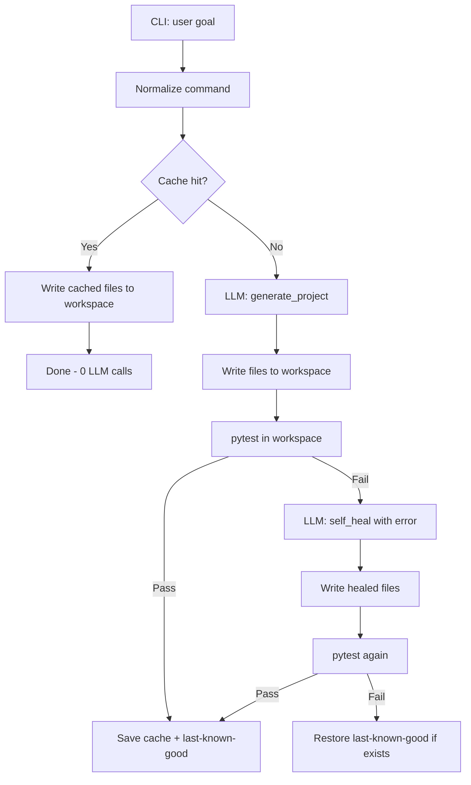

# ForgePilot

> A production-ready AI agent system that transforms natural-language goals into fully verified, test-backed Python projects—running entirely in isolated temporary sandboxes with automated self-healing.

[](https://forgepilot001.vercel.app)
[](https://forgepilot-my6c.onrender.com)
[](https://python.org)

---

## 🌐 Live Demos

* **Web UI (Vercel):** [https://forgepilot001.vercel.app](https://forgepilot001.vercel.app)
* **REST API (Render):** `https://forgepilot-my6c.onrender.com/api/generate`

---

## Table of Contents

- [Overview](#overview)
- [Features](#features)
- [How It Works](#how-it-works)
- [Project Structure](#project-structure)
- [Prerequisites](#prerequisites)
- [Installation](#installation)
- [Configuration](#configuration)
- [Usage](#usage)
- [Generated Application](#generated-application)
- [Caching](#caching)
- [LLM Budget](#llm-budget)
- [Configuration Reference](#configuration-reference)
- [Troubleshooting](#troubleshooting)
- [Security Notes](#security-notes)
- [Limitations](#limitations)

---

## Overview

You describe what you want in plain English. The agent:

1. **Normalizes** your command (lowercase, trimmed, collapsed whitespace).
2. **Checks the cache** for a prior successful result for that normalized command.
3. On a cache miss, **calls Gemini** to generate a full project as JSON (`files` → filename → source code).
4. **Writes** all files into `workspace/`.
5. **Runs `pytest`** inside `workspace/` to verify the project.
6. If validation fails, **self-heals** with a second LLM call that includes the pytest error output.
7. On success, **persists** the result to cache and as **last-known-good** for fallback.

Each run produces whatever files fit the goal, as long as they follow the [generation rules](#generation-rules-enforced-in-prompts) (flat layout, pytest, JSON output).

---

## Features

| Feature | Description |
|--------|-------------|
| **Natural-language input** | Single CLI argument: your project goal |
| **Structured LLM output** | JSON with a `files` map; no markdown or prose in responses |
| **Automatic validation** | `pytest` run in `workspace/` after every generation or heal |
| **Self-healing** | One retry with error context when tests fail |
| **Disk cache** | SHA-256 keyed cache under `.cache/` |
| **Last-known-good fallback** | Restores the last passing build if generation and self-heal both fail |
| **LLM call budget** | Hard cap (default: 2 calls) to limit cost and runaway retries |
| **Rich CLI output** | Colored progress, rules, and status via `rich` |

---

## How It Works



### Generation rules (enforced in prompts)

The LLM is instructed to:

- Place **all modules in one directory** (flat layout, no packages).
- Use **flat imports only** (`import utils`, not `from . import utils`).
- Include **at least one** `test_*.py` file; tests must pass when **`pytest` is run from `workspace/`**.
- Optionally include **`requirements.txt`** when third-party packages are needed.
- Return **only JSON** with a flexible `files` map (filenames and contents depend on the goal):

```json
{
  "files": {
    "app.py": "...",
    "test_app.py": "...",
    "requirements.txt": "..."
  }
}
```

`agent/json_utils.py` extracts the first `{` … `}` block from the model response. `cli.py` also requires a non-empty `files` dict and at least one `test_*.py` entry before writing.

On every write, **`workspace/` is cleared first** so files from a previous project (e.g. old `crud.py` or `.db` files) are not left behind.

---

## Project Structure

```
forgepilot/
├── cli.py                 # Entry point: orchestration, cache, validation, fallback
├── config.py              # Paths, model name, LLM budget, .env loading
├── requirements.txt       # Agent dependencies (LangChain, Gemini, rich, dotenv)
├── .env                   # GOOGLE_API_KEY (create locally; do not commit)
├── .cache/                # SHA-256 cache files + .good last-known-good copies
├── agent/
│   ├── llm.py             # ChatGoogleGenerativeAI (Gemini)
│   ├── prompts.py         # Shared generation / self-heal instructions
│   ├── generator.py       # Initial project generation + invoke
│   ├── self_heal.py       # Repair prompt + invoke on validation failure
│   ├── validator.py       # Runs pytest in workspace/
│   ├── cache.py           # load/save cached and last-known-good results
│   ├── normalize.py       # Command normalization for cache keys
│   ├── budget.py          # LLMBudget: consume() with hard limit
│   └── json_utils.py      # Parse and validate LLM JSON output
└── workspace/             # Output only: cleared and rewritten on each successful write
    └── (generated)        # e.g. app.py, cli.py, test_*.py, requirements.txt, *.db
```

The **agent** code lives at the repo root. **`workspace/` is not a fixed template**—it holds whatever the LLM generated for the latest goal. Any files committed there (from an earlier run) are examples only and will be removed on the next generation.

---

## Prerequisites

- **Python 3.10+** (recommended)
- A **Google AI API key** with access to Gemini models
- Network access for LLM calls (cache hits do not need the network)

---

## Installation

From the repository root:

```bash
cd /path/to/forgepilot

python3 -m venv .venv
source .venv/bin/activate   # Windows: .venv\Scripts\activate

pip install -r requirements.txt
```

### Dependencies for generated projects

The root `requirements.txt` covers the **agent** only. Generated code may need extra packages.

**Always install pytest** (the agent runs it for validation):

```bash
pip install pytest
```

If the project includes `workspace/requirements.txt` after a run:

```bash
pip install -r workspace/requirements.txt
```

Common stacks (install only what your goal produced):

| Goal type | Typical extras |
|-----------|----------------|
| HTTP API | `fastapi`, `uvicorn`, `httpx` |
| CLI | `click` or `typer` |
| Database API | `sqlalchemy`, `pydantic` |

---

## Configuration

Create a `.env` file in the project root (or export the variable in your shell):

```env
GOOGLE_API_KEY=your_google_api_key_here
```

`config.py` loads this via `python-dotenv`. LangChain’s `ChatGoogleGenerativeAI` reads `GOOGLE_API_KEY` from the environment automatically.

**Do not commit `.env` or real API keys to version control.**

---

## Usage

### Run the agent

```bash
python cli.py "Build a CLI that converts Celsius and Fahrenheit"
```

You can phrase goals differently; normalization affects **cache keys**, not the text sent to the LLM on a cache miss (the original `goal` is still passed to generation and self-heal).

**Examples:**

```bash
python cli.py "Create a minimal FastAPI app with a /health endpoint and tests"
python cli.py "Write a tiny library for slugifying strings with pytest"
python cli.py "build a cli that converts celsius and fahrenheit"   # cache key matches normalized form
```

### What you should see

1. **ForgePilot** — goal, normalized command, remaining LLM budget  
2. **Cache Lookup** — hit (instant write + exit) or miss  
3. **LLM Generation** — raw model output (via `json_utils`), then file writes  
4. **Validation (pytest)** — pass or fail with stderr  
5. On failure: **Self-Heal Attempt**, re-validation, then optional **Fallback** to last-known-good  

### Exit behavior

- **Cache hit:** writes files, prints success, **no LLM calls**
- **Generation + validation pass:** caches result, exits after success message
- **Self-heal pass:** caches healed result
- **Total failure:** attempts last-known-good restore; may leave workspace in a partial or restored state

---

## Generated project (`workspace/`)

After a successful run, `workspace/` contains **only** the files for that goal. There is no required filename like `main.py` or `crud.py`—the set is entirely up to the LLM, subject to:

| Requirement | Why |
|-------------|-----|
| At least one `test_*.py` | Agent validation runs `pytest` |
| Flat filenames only (no `src/pkg/mod.py`) | Enforced in prompts and `write_files()` |
| Optional `requirements.txt` | Documents deps for you to `pip install` |

**Examples of what you might see:**

| Goal | Possible files |
|------|----------------|
| Health-check API | `main.py`, `test_main.py`, `requirements.txt` |
| Temperature CLI | `cli.py`, `converter.py`, `test_cli.py` |
| Slugify library | `slugify.py`, `test_slugify.py` |

### Run the project locally

Depends on what was generated—for example:

```bash
cd workspace
pip install -r requirements.txt   # if present
pytest                            # same check the agent uses

# If it's a FastAPI app with main:app:
uvicorn main:app --reload

# If it's a CLI module:
python cli.py --help
```

### Run tests manually

```bash
cd workspace
pytest
```

This is the same command the agent runs in `agent/validator.py`.

---

## Caching

Cache keys are **SHA-256 hashes** of the **normalized** command string.

| File | Purpose |
|------|---------|
| `.cache/<hash>` | Full serialized result (`str(dict)`) after a successful validation |
| `.cache/<hash>.good` | Last-known-good copy for fallback |

**Normalization** (`agent/normalize.py`):

- Lowercase  
- Strip leading/trailing whitespace  
- Collapse internal whitespace to single spaces  

So `"Create  a  FastAPI App"` and `"create a fastapi app"` share the same cache key.

On a **cache hit**, the agent uses `eval()` on cached content (trusted internal cache only—do not hand-edit cache files with untrusted input).

To force a fresh generation, delete the matching file in `.cache/` or change the wording so the normalized form differs.

---

## LLM Budget

`config.py` sets `MAX_LLM_CALLS = 2`:

1. **First call:** `generate_project()`  
2. **Second call (optional):** `self_heal()` if pytest fails  

`LLMBudget.consume()` raises if the budget is exhausted. The CLI prints remaining budget at key steps.

---

## Configuration Reference

| Setting | File | Default | Description |
|---------|------|---------|-------------|
| `WORKSPACE_DIR` | `config.py` | `./workspace` | Output directory for generated files |
| `CACHE_DIR` | `config.py` | `./.cache` | Disk cache location |
| `GEMINI_MODEL` | `config.py` | `gemini-2.5-flash` | Model id for `ChatGoogleGenerativeAI` |
| `MAX_LLM_CALLS` | `config.py` | `2` | Max LLM invocations per CLI run |
| `GOOGLE_API_KEY` | `.env` / env | — | Required for generation and self-heal |

---

## Troubleshooting

### `Error: Please provide a command`

Pass the goal as the first argument:

```bash
python cli.py "your goal here"
```

### `LLM budget exhausted`

You already used two LLM calls in one run. Re-run the CLI (new budget) or fix the project manually under `workspace/`.

### `Generation failed` / JSON errors

- Check `GOOGLE_API_KEY` is set and valid.  
- Confirm network access to Google’s API.  
- Inspect **Raw LLM Output** in the terminal; the model must return parseable JSON with a `files` object.

### Validation fails repeatedly

- Read pytest stderr printed after **Validation Failed**.  
- Run `cd workspace && pytest -v` for full tracebacks.  
- Delete `.cache/<hash>` to avoid reusing a bad cached entry.  
- Simplify or clarify the goal string for the next generation attempt.

### `ModuleNotFoundError` when running tests or uvicorn

Install workspace dependencies (see [Installation](#dependencies-for-the-generated-app)).

### Cache serves stale code

Remove `.cache/` entries for that command’s normalized hash, or bump `MAX_LLM_CALLS` / change prompts in `agent/generator.py` and regenerate.

---

## Security Notes

- **API keys:** Keep `GOOGLE_API_KEY` in `.env` or a secret manager; add `.env` to `.gitignore` if you use git.  
- **Cache `eval()`:** Cached values are evaluated as Python literals. Only the agent should write cache files.  
- **Generated code:** Review LLM output before deploying to production; this tool is aimed at local development and experimentation.  
- **Generated artifacts:** Databases, temp files, or secrets created under `workspace/` during tests should not be deployed as-is.

---

## Limitations

- **Small scale only:** A single directory, a handful of modules; not for large apps or monorepos.  
- **Flat layout only:** No packages, `src/` trees, or nested project layouts.  
- **pytest only:** No automatic linting, typing, or non-Python stacks.  
- **No incremental edits:** Each full miss regenerates (or heals) the whole `files` map.  
- **Budget of two:** No multi-step repair loop beyond one self-heal pass.  
- **Model availability:** Depends on Gemini API and the configured `GEMINI_MODEL` name.  
- **Stale cache:** Old cache entries may still contain a previous CRUD-shaped project until you invalidate the cache.

---

## Development

### Run a quick smoke test (no LLM)

If a valid cache entry exists for your normalized command, a repeat run uses zero API calls:

```bash
python cli.py "create a fastapi crud app with sqlite"
```

---

## 🏗️ Web & Engine Architecture

Unlike traditional LLM wrappers that output unverified code snippets, **ForgePilot** executes and validates generated applications in real time inside isolated temporary execution environments before serving results to the user.

### Adjust behavior

| Change | Where |
|--------|--------|
| Model or call limit | `config.py` |
| Generation / heal instructions | `agent/prompts.py` |
| Validation command | `agent/validator.py` |
| Cache key logic | `agent/normalize.py`, `agent/cache.py` |

---

## License

No license file is included in this repository. Add one if you plan to distribute or open-source the project.
